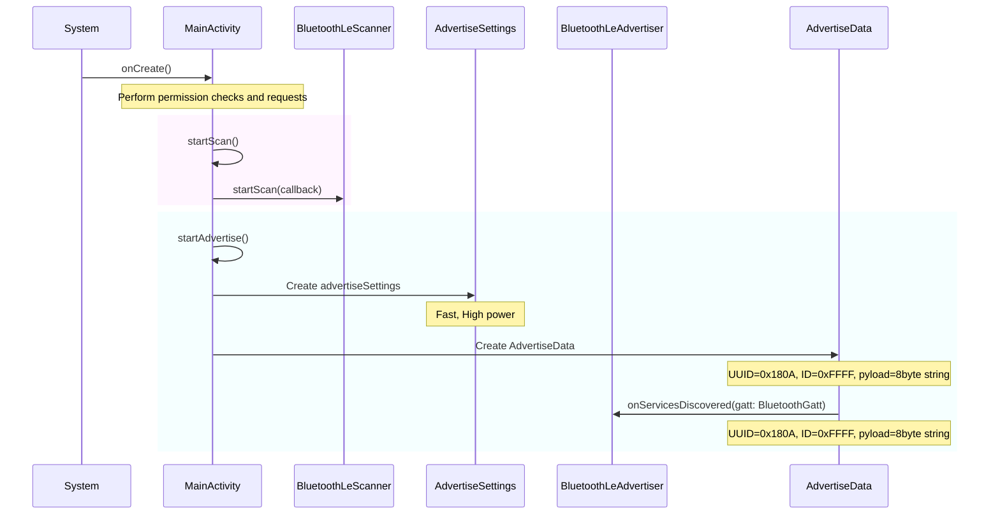
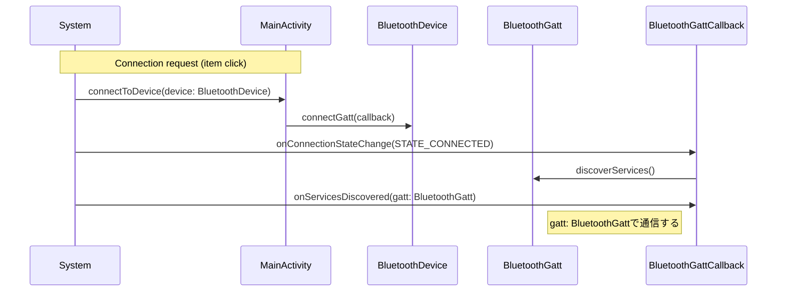

# AndKot-BLESampleC
BLE Sample code for android kotlin

## Advertise/Scan sequence

```mermaid
sequenceDiagram
  participant System
  participant MainActivity
  participant BluetoothLeScanner
  participant AdvertiseSettings
  participant BluetoothLeAdvertiser
  participant AdvertiseData

  %% -------------------
  System ->> MainActivity: onCreate()
  Note over MainActivity: Perform permission checks and requests

  %% --- scan ---
  rect rgba(255,0,255,0.04)
    MainActivity ->> MainActivity: startScan()
    MainActivity ->> BluetoothLeScanner: startScan(callback)
  end

  %% --- Advertise ---
  rect rgba(0,255,255,0.04)
    MainActivity ->> MainActivity: startAdvertise()
    MainActivity ->> AdvertiseSettings: Create advertiseSettings
    Note over AdvertiseSettings: Fast, High power
    MainActivity ->> AdvertiseData: Create AdvertiseData
    Note over AdvertiseData: UUID=0x180A, ID=0xFFFF, pyload=8byte string
    AdvertiseData ->> BluetoothLeAdvertiser: onServicesDiscovered(gatt: BluetoothGatt)
    Note over AdvertiseData: UUID=0x180A, ID=0xFFFF, pyload=8byte string
  end

```

## Connect seqence

```mermaid
sequenceDiagram
  participant System
  participant MainActivity
  participant BluetoothDevice
  participant BluetoothGatt
  participant BluetoothGattCallback

  %% -------------------
  Note over System,MainActivity: Connection request (item click)
  System ->> MainActivity: connectToDevice(device: BluetoothDevice)
  MainActivity ->> BluetoothDevice: connectGatt(callback)
  System ->> BluetoothGattCallback: onConnectionStateChange(STATE_CONNECTED)
  BluetoothGattCallback ->> BluetoothGatt: discoverServices()
  System ->> BluetoothGattCallback: onServicesDiscovered(gatt: BluetoothGatt)
  Note right of BluetoothGatt: gatt: BluetoothGattで通信する
```
